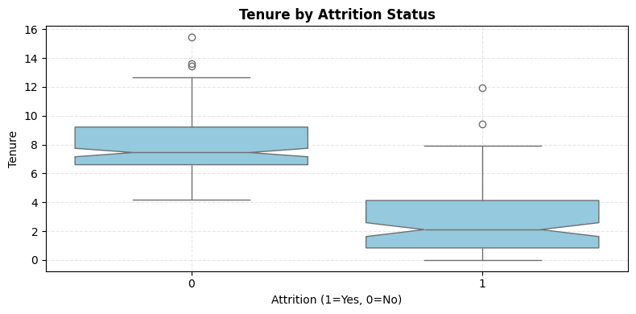
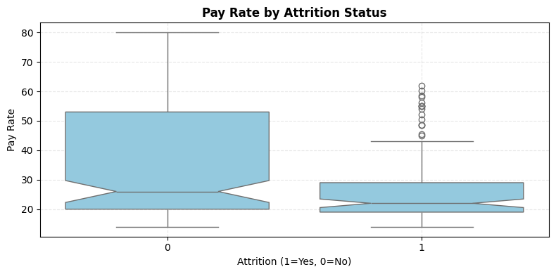
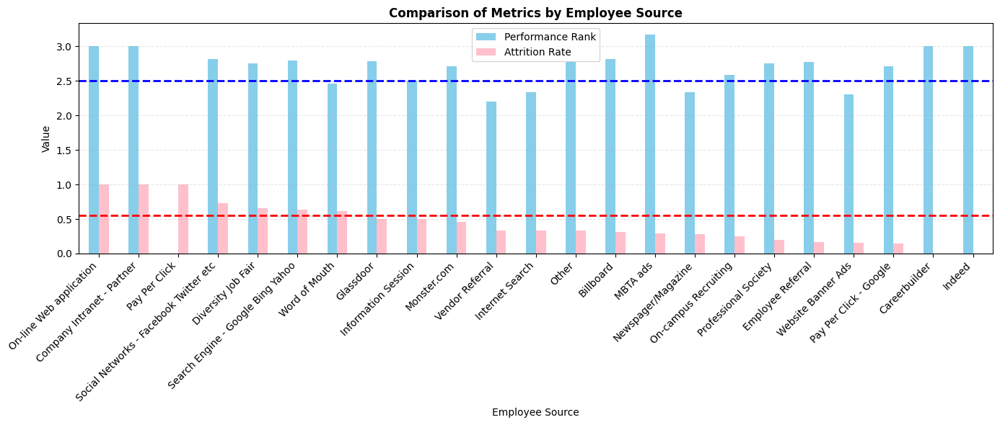

# **이탈률 분석 보고서**
 

본 프로젝트는 HR 데이터 분석을 통해 <U>**직원 이탈률(Attrition Rate)**</U>의 전반적인 현황을 파악하고, 이탈에 영향을 주는 요인을 탐구함으로써 <U>**조직의 리텐션 전략 수립**</U>에 기여하는 것을 목적으로 한다.
 
 

## 1. Data Overview
- **총 직원 수** : 310명
- **이탈자 수**: 116명
- **이탈률** : 37.42%
 
 

## 2. 주요 분석 결과
> ### **근속연수(Tenure)**
* 이탈자(Attrition = 1)의 근속연수 중앙값이 2년 안팎으로 분포
* 잔류자(Attrition = 2)의 중앙값은 7년 이상  
→ 이를 통해 이탈자는 명확히 저연차에 분포하고 있음을 알 수 있음    
  
<figure>
  
  <figcaption><b>Fig 1.</b> 근속연수에 따른 이탈 여부 분포</figcaption>
</figure>

---
>### **급여(Pay Rate)**
* 이탈자의 대부분은 낮은 급여 구간에 존재  
→ 잔류자 대비 명확한 급여 차이 존재  
 
 일반적으로, 근속연수가 짧을수록 급여도 낮기 때문에, Pay Rate↓가 실제로는 Tenure ↓의 결과라고 해석할 수 있다.

<figure>
  
  <figcaption><b>Fig 2.</b> 급여에 따른 이탈 여부 분포</figcaption>
</figure>

---

>### 성과(Performance Rank)
ANOVA 분석 결과, 성과(Performance Rank)는 성별, 직책, 부서, 인종 등의 인적/조직적 요인과 통계적으로 유의한 차이를 보이지 않았다. 이는 현재 조직 내 성과 평가가 특정 집단에 치우치지 않고 상대적으로 공정하게 분포되어 있을 가능성을 시사한다.

|변수            |F-value | p-value   |
|---------------|--------|-----------|
|**Sex**        | 1.191  |   0.276   | 
|**Position**   | 1.113  |   0.324   |
|**Department** | 0.584  |   0.712   |
|**Race**       | 0.158  |   0.924   |
**Table 1.** ANOVA 결과

---
>### 채용 경로(Employee Source)

* **성과 우수 & 이탈률 낮은 채용 소스 <U>(이상적인 채널)</U>**  

    * Vendor Referral

    * Internet Search

    * Newspaper/Magazine

    * Website Banner Ads  
 
    <U>*→ 이 경로는 조직에 우수한 인재를 유입시킬 뿐 아니라, 근속 기간도 길게 유지되는 경향을 보여주므로, 우선적으로 채용 예산 및 자원 투입을 고려할 수 있는 전략적 채용 경로라고 볼 수 있다.*</U>
    
 

* **성과 낮고 & 이탈률 높은 채용 소스 <U>(재검토 필요)</U>**
    * Social Networks – Facebook, Twitter 등

    * Diversity Job Fair

    * Search Engine – Google, Bing, Yahoo

    <U>*→ 이 경로를 통해 입사한 인원은 평균적으로 성과가 낮고, 조직에 오랜 기간 머무르지 않는 경향을 보인다. 따라서 전략적인 축소 또는 채용 후 온보딩, 정착 프로세스 개선이 필요한 경로라고 볼 수 있다.*</U>

 

<figure>
  
  <figcaption><b>Fig 3.</b> 채용 경로에 따른 이탈률과 성과 비교</figcaption>
</figure>

 

## 3. 주요 시사점
분석 결과, 직원 이탈은 주로 근속 4년 이하의 저연차에서 발생하며, 낮은 급여가 동반되는 경우가 많은 것으로 확인되었다. 이는 입사 초기의 조직 적응 실패, 기대 불일치, Micromanagement와 밀접한 관련이 있을 수 있다.   
또한, 채용 경로 별 이탈률과 성과에서 차이를 보였는데, Vendor Referral이나 Website Banner Ads와 같은 채널은 성과와 잔존율 모두 우수한 반면, Social Networks나 Job Fair 경로는 성과와 리텐션 모두 낮은 결과를 보였다.  
성과 부분에서는 어려 인적, 조직적 요인이 성과와 통계적으로 유의미한 차이가 없는 것으로 보아, 현재 조직 내 인사평가가 비교적 공정하게 이뤄지고 있다고 해석할 수 있다.

 

## 4. 제안 사항
✅ 초기 적응(온보딩) 및 멘토링 체계 강화  
이탈자가 주로 저연차인 점을 고려할 때, 입사 초기 구성원의 몰입도와 적응도를 높이는 제도적 장치 마련이 필요하다.  
*ex. 1:1 멘토링, Onboarding 체크리스트, 입사한 지 1년이 지난 후 적응도 체크 등*

 

✅ 성과 및 리텐션이 우수한 채용 경로 중심의 채용 전략 재편  
✅ 보상체계 개선 검토  
*ex. 성과 연계형 보상, 복리후생 개선*

 

✅ 관리자 대상 리더십 교육 강화
관리자 스스로 Micromanagement를 인식하지 못하는 경우가 많기 때문에 교육이 필요하다.  
*ex. 코칭형 리더십, 자율성 부여 등의 주제*

✅ 직원 피드백 시스템 개선  
*ex. 리더십 다면진단 평가, 1:1 미팅 등을 이용*

